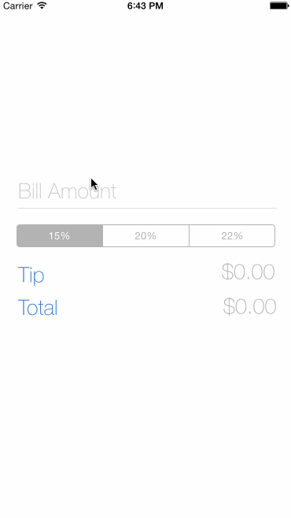

# Tip Calculator

My first swift project!

Time spent: 1.5 hours in total

Completed user stories:

 * [x] Required: User can calculate the tips and get real-time updates.
 * [x] Required: User can click the view to hide keyborad.
 * [x] Optional: Add app icon and image asset. Customize fonts. 

Walkthrough:

GIF created with [LiceCap](http://www.cockos.com/licecap/).
